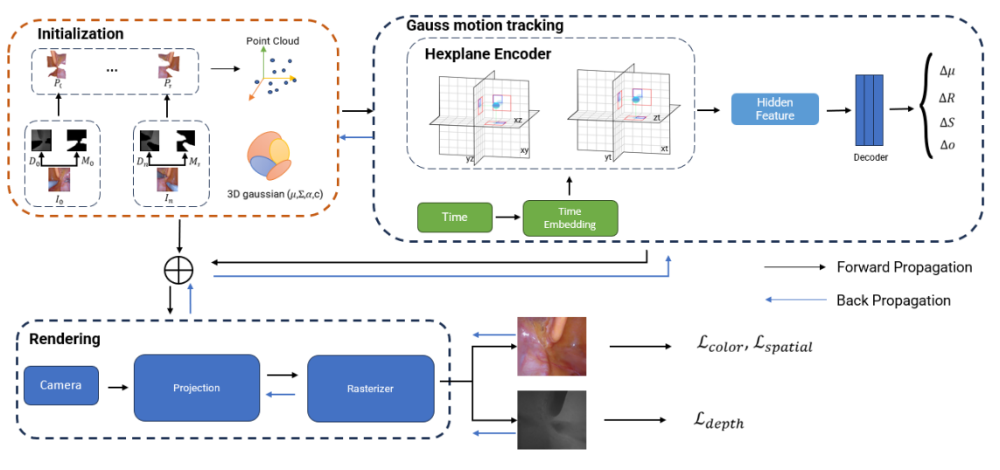

# 3-D Reconstruction from Consecutive Endoscopic Images using Gaussian Splatting [Paper](https://openaccess.thecvf.com/content/ACCV2024W/MLCSA2024/papers/Minh_3-D_Reconstruction_from_consecutive_endoscopic_images_using_Gaussian_Splatting_ACCVW_2024_paper.pdf)

## Abstract

> &#160; Recent advancements in 3D reconstruction helped endoscopy doctors analyze the patients’ gastrointestinal surfaces and abnormality detections. In this work, we expand this development further with a reconstruction method based on both classic techniques like structure from motion and recent advanced techniques like neural radiation fields and Gaussian splatting with new Gaussian encoding-decoding modules. In addition, an unique dataset was collected with some videos from daily endoscopy examinations. This development helped us achieve better reconstruction results and lower training time compared to existing methods.



## ✨ Citation

Please CITE `our paper` and give us a ⭐ whenever this repository is used to help produce published results or incorporated into other software.

```bib
@InProceedings{Minh2025,
title={3-D Reconstruction from Consecutive Endoscopic Images Using Gaussian Splatting},
booktitle={ACCV 2024 Workshops},
author={Hung-Le Minh, Duy-Van Truong, Huy-Xuan Manh, Viet-Hang Dao, Phuc-Binh Nguyen, Thanh-Tung Nguyen and Hai-Vu}
year={2025},
}
```

## Project structure

```bash
IGH_ENDO_GS/
├── arguments/ # Argument parsing or configuration scripts
├── gaussian_renderer/ # Rendering related code
├── lpipsPyTorch/ # Perceptual loss (LPIPS) implementation
├── media/ # Media resources (images, videos, etc.)
├── scene/ # Scene definitions or data
├── submodules/ # Submodules or third-party libraries
├── utils/ # helper functions
├── convert.py # Script for data conversion
├── full_eval.py # Full evaluation script
├── metrics.py # Metrics computation
├── render.py # Rendering pipeline script
├── requirements.txt # Python dependencies
├── train_ver1.py # Training script (version 1)
├── train_ver2.py # Training script (version 2)
├── train.sh # Shell script to run training
└── README.md # Project documentation
```

## Installation

```bash
git clone git@github.com:HungLM1506/IGH_Endo_GS.git
cd IGH_Endo_GS
git submodule update --init --recursive
conda create -n IGH_Endo_GS python=3.7
conda activate IGH_Endo_GS

pip install -r requirements.txt
pip install -e submodules/depth-diff-gaussian-rasterization
pip install -e submodules/simple-knn
```

## Dataset

**EndoNeRF:**  
The dataset provided in [EndoNeRF](https://arxiv.org/abs/2206.15255) is used. You can download and process the dataset from their website (https://github.com/med-air/EndoNeRF). We use the two accessible clips including 'pulling_soft_tissues' and 'cutting_tissues_twice'.

## Trainning

comming soon

## Evaluating

comming soon

## Acknowledgments

comming soon
